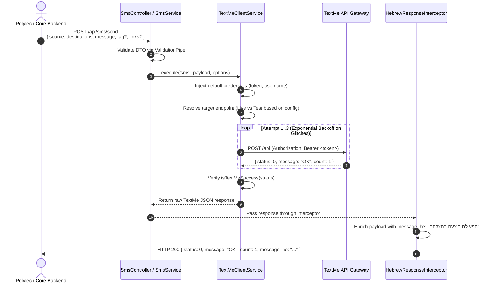
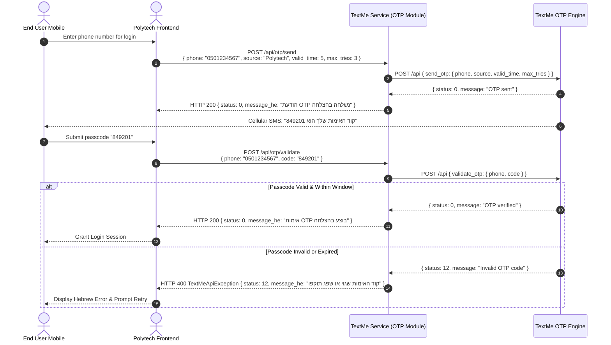
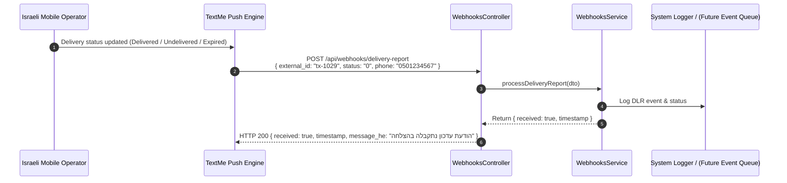
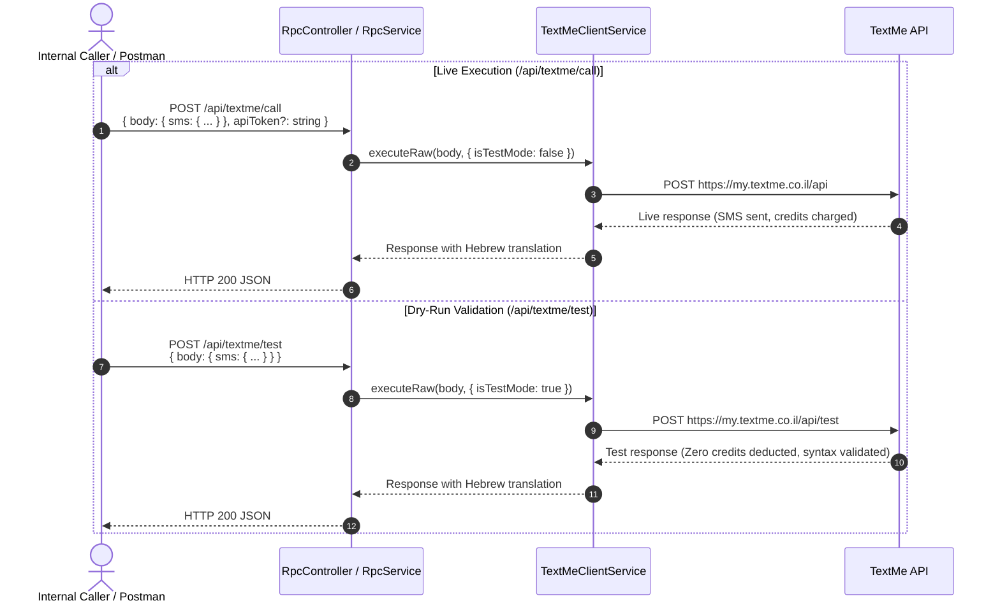

# Architecture Document: TextMe Enterprise Microservice

## 1. Overview & Objectives

**TextMe Enterprise Service** is a dedicated, production-grade NestJS microservice designed to serve as the unified telecom and SMS gateway for the Polytech platform ecosystem. It integrates the complete [TextMe API](https://docs.textme.co.il/) (all 30 operations across 12 distinct functional domains).

### Core Objectives:
1. **Unified Gateway for Cellular Operations**: Abstracts low-level telecom protocols into clean, RESTful APIs for single SMS, high-volume bulk batches (up to 2,500 messages), one-time passwords (OTP), carrier reports, contact distribution lists, and reseller sub-accounts.
2. **Dual-Mode Reliability & Zero-Cost Testing**: Supports seamless switching between the live TextMe production endpoint (`https://my.textme.co.il/api`) and the dry-run test sandbox (`https://my.textme.co.il/api/test`), allowing full payload schema and credential validation without burning credits or sending unintended messages.
3. **Resilient Network Layer**: Encapsulates automatic retry loops with exponential backoff and jitter, defensive timeouts, and comprehensive status code normalization.
4. **Mandatory Hebrew Localization**: Adheres strictly to Polytech Engineering Standards by translating all API error codes, status reports, carrier delivery receipts (DLR), and validation messages into Hebrew.
5. **Generic RPC Gateway**: Provides a passthrough interface (`/api/textme/call` and `/api/textme/test`) allowing upstream services to dispatch arbitrary TextMe payloads with automated credential injection and Hebrew enrichment.

---

## 2. System Architecture

```mermaid
flowchart TD
    subgraph ClientLayer [Consumer Layer]
        PolytechCore[Polytech Core Backend / Services]
        AdminUI[Polytech Admin Dashboard]
        CronJobs[Scheduled Automation / Cron Workers]
    end

    subgraph TextMeMicroservice [TextMe Enterprise NestJS Microservice]
        subgraph Ingress [Ingress & Middleware Pipeline]
            GlobalPrefix["/api Global Prefix"]
            ValidationPipe["ValidationPipe (Whitelist & Transform)"]
            HebrewInterceptor["HebrewResponseInterceptor\n- Injects message_he\n- Maps DLR he_message"]
            ExceptionFilter["TextMeExceptionFilter\n- Catches TextMeApiException\n- Translates Errors to Hebrew"]
        end

        subgraph Modules [Feature Modules]
            TokensMod[Tokens Module]
            SmsMod[SMS Module]
            OtpMod[OTP Module]
            BalanceMod[Balance Module]
            ReportsMod[Reports Module]
            BlacklistMod[Blacklist Module]
            ContactListsMod[Contact Lists Module]
            CampaignsMod[Campaigns Module]
            SendersMod[Verified Senders Module]
            SubscribersMod[Subscribers Module]
            WebhooksMod[Webhooks Module]
            RpcMod[RPC Gateway Module]
        end

        subgraph CoreEngine [TextMe Client Core Engine]
            ClientService[TextMeClientService\n- Payload Enrichment\n- Test Mode Router\n- Exponential Backoff Retry]
            AxiosHttp[Axios HTTP Instance\n- Configurable Timeout]
            HebrewDict[Hebrew Translation Engine\n- DLR Status Matrix\n- Error Code Mapping]
        end
    end

    subgraph ExternalGateway [TextMe Telecom Infrastructure (Israel)]
        TextMeLive["TextMe Live API\n(https://my.textme.co.il/api)"]
        TextMeTest["TextMe Dry-Run API\n(https://my.textme.co.il/api/test)"]
        CarrierNetworks["Israeli Cellular Carriers\n(Cellcom, Partner, Pelephone, HOT)"]
    end

    subgraph PushIngress [TextMe Push Inbound Webhooks]
        TextMePusher[TextMe Webhook Server]
    end

    %% Consumer flows
    ClientLayer -->|HTTP REST / S2S Request| GlobalPrefix
    GlobalPrefix --> ValidationPipe
    ValidationPipe --> Modules
    Modules --> ClientService
    ClientService --> AxiosHttp
    AxiosHttp -->|isTestMode = false| TextMeLive
    AxiosHttp -->|isTestMode = true| TextMeTest
    TextMeLive --> CarrierNetworks

    %% Webhook Flows
    TextMePusher -->|POST /api/webhooks/delivery-report| WebhooksMod
    TextMePusher -->|POST /api/webhooks/incoming-message| WebhooksMod
    TextMePusher -->|POST /api/webhooks/blocklist-addition| WebhooksMod

    %% Interceptor & Filter
    Modules --> HebrewInterceptor
    HebrewInterceptor --> HebrewDict
    HebrewInterceptor --> ClientLayer
    ExceptionFilter --> HebrewDict
    ExceptionFilter --> ClientLayer
```

---

## 3. Detailed Workflows & Sequence Diagrams

### 3.1 Single & Bulk SMS Dispatch Flow



### 3.2 OTP Generation & Verification Lifecycle



### 3.3 Real-Time Push Webhook Notification Flow



### 3.4 Generic RPC Gateway & Dry-Run Pipeline



---

## 4. Key Design Decisions

### 4.1 Stateless Gateway vs State Persistence
- **Current Architecture**: The service operates as a stateless proxy/adapter microservice. It transforms incoming REST requests to TextMe JSON/XML payloads, handles authentication tokens, validates schemas, and maps responses.
- **Architectural Rationale**: High throughput, zero database latency, trivial horizontal scalability, and low operational overhead.
- **Evolution Plan**: Because webhooks currently log incoming events to console, production deployment requires introducing a persistence or streaming layer (e.g., MongoDB, PostgreSQL, or Redis / BullMQ) to capture inbound messages and DLR history for core platform analytics.

### 4.2 Non-Standard Status Code Mapping
TextMe's API uses domain-specific status codes that depart from standard HTTP conventions:
- `0`: General Success (`TEXTME_STATUS.SUCCESS`).
- `946`: Success specifically for enrolling phone numbers into the blocklist (`addNumBL`). TextMe returns `status: 946` upon successful addition.
- `944`: Partial success for blocklist removal (`rmNumBL`), indicating some numbers were removed while others were not found.
- The `isTextMeSuccess(statusCode, operation)` helper encapsulates this logic centrally, preventing false positive exceptions while ensuring real errors (such as `4` - insufficient credits, or `515` - unverified sender) trigger structured `TextMeApiException` responses.

### 4.3 Mandatory Hebrew Localization Layer
In strict compliance with Polytech Engineering Guidelines:
- **`HebrewResponseInterceptor`**: Automatically intercepts every successful outgoing controller response and injects `message_he`. If the payload contains carrier transactions (such as DLR reports), each transaction is mapped to its Hebrew carrier status (`נמסר`, `נכשל`, `פג תוקף`, etc.).
- **`TextMeExceptionFilter`**: Catches both `TextMeApiException` and generic NestJS `HttpException` instances, translating English validation strings (e.g., `"phone must be a valid phone number"`) into clean Hebrew descriptions (`"מספר הטלפון אינו תקין"`).

### 4.4 Transport Resilience & Retry Engine
- External cellular gateways occasionally experience transient 502/503/504 gateway timeouts or connection resets.
- `TextMeClientService` implements a configurable retry loop (default `2` retries, `500ms` initial backoff delay doubling exponentially).
- If the retry loop is exhausted, a structured `TextMeApiException` is raised containing the root cause and full error context.

### 4.5 Dual-Environment & Dry-Run Routing
- Testing live SMS messaging is expensive and risks accidental message broadcasts to real customers.
- TextMe provides a dedicated dry-run endpoint: `https://my.textme.co.il/api/test`.
- The service dynamically routes traffic based on `TEXTME_IS_TEST_MODE=true` (or the request-level `isTestMode` option), allowing developers and automated test suites to validate payloads against TextMe's live servers with zero balance deduction.

### 4.6 Strict Validation & Zero Magic Values
- Requests are validated strictly using `class-validator` and `class-transformer` via a global `ValidationPipe` with `whitelist: true`.
- Zero magic numbers or strings exist in application code. All statuses, header names, endpoints, timeouts, and validation messages are maintained in `common/constants/`.

---

## 5. Module & Directory Structure

```text
src/
├── main.ts                                 # NestJS bootstrap, CORS, global prefix, ValidationPipe
├── app.module.ts                           # Root module importing all 12 domains & global providers
├── app.controller.ts                       # Health check endpoint controller
├── app.service.ts                          # Health check telemetry & status
├── config/
│   ├── config.constants.ts                 # Configuration keys and default values
│   └── textme.config.ts                    # Dynamic environment configuration loader
├── common/
│   ├── constants/
│   │   ├── api.constants.ts                # URLs, headers, endpoints, and operation key registry
│   │   ├── status-codes.constants.ts       # TextMe status code enum & success validator
│   │   ├── dlr-statuses.constants.ts       # Carrier DLR delivery status constants
│   │   └── validation-messages.constants.ts# Centralized validation error messages
│   ├── dto/
│   │   ├── base-response.dto.ts            # Common API response interfaces
│   │   └── textme-user.dto.ts              # Embedded user credentials DTO
│   ├── errors/
│   │   ├── textme-api.exception.ts         # Custom typed exception preserving TextMe status
│   │   └── textme-exception.filter.ts      # Global exception filter translating errors to Hebrew
│   ├── i18n/
│   │   ├── hebrew-translations.constants.ts# Comprehensive English-to-Hebrew translation dictionary
│   │   └── hebrew-translations.spec.ts     # Translation unit tests
│   └── interceptors/
│       └── hebrew-response.interceptor.ts  # Global response interceptor injecting message_he
├── textme-client/                          # Central HTTP client module
│   ├── textme-client.module.ts
│   ├── textme-client.service.ts            # Axios wrapper, retry logic, error interceptor
│   └── textme-client.types.ts              # Request options and raw response types
├── tokens/                                 # API token minting and current active token lookup
├── sms/                                    # Single SMS and bulk batch SMS dispatch
├── otp/                                    # OTP code generation, dispatch, and verification
├── balance/                                # SMS, international, and email credit balance query
├── reports/                                # DLR by ID, DLR by date range, inbound message logs
├── blacklist/                              # Account do-not-contact blocklist query, add, remove
├── contact-lists/                          # Distribution list management and dynamic contacts
├── campaigns/                              # Scheduled broadcast cancellation & birthday campaigns
├── verified-senders/                       # Sender phone verification & carrier ID listing
├── subscribers/                            # Reseller sub-account provisioning & wallet management
├── webhooks/                               # Inbound push callbacks (DLR, inbound SMS, opt-outs)
└── rpc/                                    # Generic live and dry-run RPC proxy gateway
```

---

## 6. Complete API Specification Summary

| Domain | Method | Endpoint Path | TextMe Root Key | Description |
| :--- | :--- | :--- | :--- | :--- |
| **Health** | `GET` | `/api/health` | — | Runtime telemetry, environment status & Hebrew health message |
| **Tokens** | `POST` | `/api/tokens/create` | `getApiToken` (`new`) | Issues a new API bearer token, invalidating prior active tokens |
| **Tokens** | `POST` | `/api/tokens/current` | `getApiToken` (`current`) | Retrieves currently active API bearer token without re-issuing |
| **SMS** | `POST` | `/api/sms/send` | `sms` | Sends single SMS to individual numbers or contact lists with merge tags |
| **SMS** | `POST` | `/api/sms/bulk` | `bulk` | Batch sends up to 2,500 distinct personalized messages |
| **OTP** | `POST` | `/api/otp/send` | `send_otp` | Generates and sends OTP passcode with validity window and max tries |
| **OTP** | `POST` | `/api/otp/validate` | `validate_otp` | Validates passcode submitted by user against TextMe OTP registry |
| **Balance** | `POST` | `/api/balance/query` | `balance` | Queries account credit balance across SMS, international, or email |
| **Reports** | `POST` | `/api/reports/dlr` | `dlr` | Queries carrier delivery receipts by external transaction IDs |
| **Reports** | `POST` | `/api/reports/dlr-by-date` | `dlrByDate` | Queries carrier delivery receipts across a date-time interval |
| **Reports** | `POST` | `/api/reports/incoming` | `incoming` | Retrieves inbound 2-way SMS received on virtual account numbers |
| **Blacklist** | `POST` | `/api/blacklist/query` | `blacklist` | Retrieves list of blocked phone numbers added during a date window |
| **Blacklist** | `POST` | `/api/blacklist/add` | `addNumBL` | Enrolls numbers into account blacklist (mapped to success code `946`) |
| **Blacklist** | `POST` | `/api/blacklist/remove` | `rmNumBL` | Removes numbers from blacklist with reason (handles partial code `944`) |
| **Contact Lists** | `POST` | `/api/contact-lists/create` | `newCL` | Provisions new distribution lists with optional member contacts |
| **Contact Lists** | `POST` | `/api/contact-lists/remove` | `removeCL` | Permanently deletes distribution contact lists by ID |
| **Contact Lists** | `POST` | `/api/contact-lists/add-numbers` | `addNumCL` | Appends recipient numbers and merge fields to existing list |
| **Contact Lists** | `POST` | `/api/contact-lists/remove-numbers` | `rmNumCL` | Removes recipient numbers from existing contact list |
| **Contact Lists** | `POST` | `/api/contact-lists/all` | `getCL` | Fetches metadata and recipient counts for all account lists |
| **Contact Lists** | `POST` | `/api/contact-lists/by-id` | `getCLbyID` | Retrieves member phone numbers and dynamic fields for a specific list |
| **Campaigns** | `POST` | `/api/campaigns/cancel-by-id` | `cancel` | Cancels scheduled SMS broadcast using numerical campaign ID |
| **Campaigns** | `POST` | `/api/campaigns/cancel-by-name` | `cancel` | Cancels scheduled broadcasts matching campaign name handle |
| **Campaigns** | `POST` | `/api/campaigns/birthday` | `get_birthday_campaigns` | Lists recurring birthday and anniversary campaign rules |
| **Campaigns** | `POST` | `/api/campaigns/birthday/edit` | `edit_birthday_campaign` | Updates template text, dispatch timing, or sender for birthday campaign |
| **Verified Senders** | `POST` | `/api/verified-senders/verify` | `verify_phone` | Submits phone number for carrier sender ID verification via SMS code |
| **Verified Senders** | `POST` | `/api/verified-senders/all` | `getVerifiedPhones` | Retrieves all approved alphanumeric and numeric sender IDs |
| **Subscribers** | `POST` | `/api/subscribers/add` | `addSub` | Provisions subordinate reseller sub-account with assigned balance |
| **Subscribers** | `POST` | `/api/subscribers/update-wallet` | `updateAmountSub` | Adjusts credit balance or monetary wallet for a sub-account |
| **Subscribers** | `POST` | `/api/subscribers/balances` | `getBlanceSubs` | Queries live balances across all provisioned reseller sub-accounts |
| **Webhooks** | `POST` | `/api/webhooks/push-url/register` | `push_url` | Registers server-side push callback URL with TextMe for event feeds |
| **Webhooks** | `POST` | `/api/webhooks/delivery-report` | — | Ingests real-time carrier delivery receipt callbacks |
| **Webhooks** | `POST` | `/api/webhooks/incoming-message` | — | Ingests pushed inbound 2-way SMS messages |
| **Webhooks** | `POST` | `/api/webhooks/blocklist-addition` | — | Ingests pushed opt-out / unsubscribe callbacks |
| **RPC Gateway** | `POST` | `/api/textme/call` | *dynamic* | Live RPC proxy forwarding arbitrary payloads to TextMe API |
| **RPC Gateway** | `POST` | `/api/textme/test` | *dynamic* | Dry-run RPC proxy validating arbitrary payloads against `/api/test` |

---

## 7. Standards & Quality Compliance (Per AGENTS.md)

1. **Package Manager**: All dependencies and scripts strictly managed via `pnpm`.
2. **Type Safety**: 100% typed with TypeScript interfaces and DTOs; zero `any` usage. Continuous type checking via `pnpm run typecheck`.
3. **No Magic Strings or Numbers**: All status codes, error messages, endpoints, timeouts, and validation strings reside in centralized `constants/` files.
4. **Validation**: Exclusively `class-validator` and `class-transformer` (no Zod or Joi).
5. **Hebrew Responses**: Every API response, validation failure, and carrier status is translated and returned in Hebrew via `HebrewResponseInterceptor` and `TextMeExceptionFilter`.
6. **Testing Suite**:
   - Unit Testing: Jest (`pnpm test`) covering services, retry handling, and translation matrix.
   - E2E Testing: Playwright (`pnpm run test:playwright`) and Jest/Supertest (`pnpm run test:e2e`).
   - Postman Collection: Automated runner via Newman (`pnpm run test:newman`).
7. **Linting**: Oxlint automated checks (`pnpm run lint`).
8. **Secrets & Environment Confidentiality**: Strict zero-inspection policy on all `.env` files.

---

## 8. Advanced Architectural Roadmap & Specifications

### 8.1 Ingress Webhook Broker & Event Storage
- **Context**: Currently, pushed delivery reports (DLR), incoming 2-way SMS, and blocklist additions are processed in memory and logged.
- **Specification**:
  - Deploy an asynchronous event pipeline (e.g., Redis + BullMQ or GCP Pub/Sub).
  - Inbound webhooks will enqueue events into a `textme-events` queue with a 200 OK acknowledgment within 50ms.
  - Workers will persist message delivery states to MongoDB/PostgreSQL and emit webhook notifications to consumer microservices in the Polytech cluster.

### 8.2 Service-to-Service (S2S) Security Hardening
- **Context**: Because sending SMS incurs real monetary charges, public access must be strictly forbidden.
- **Specification**:
  - Introduce an `InternalAuthGuard` validating an `X-Internal-API-Key` header or HMAC-SHA256 signature (`X-Signature`, `X-Timestamp`).
  - Restrict webhook callback endpoints to TextMe's known egress IP ranges or validate a shared secret token in the callback URL query string.

### 8.3 Carrier Rate Limiting & Throttling
- **Context**: Israeli telecom operators (Cellcom, Partner, Pelephone, HOT Mobile) impose transactions-per-second (TPS) limits on sender IDs (commonly 5–20 TPS).
- **Specification**:
  - Activate `@nestjs/throttler` (already in `package.json`).
  - Implement a token bucket rate limiter to meter outgoing bulk requests, chunking high-volume batches into rate-controlled sub-batches to prevent carrier blocking.

### 8.4 Multi-Tenant Credential Store & Dynamic Token Rotation
- **Context**: Multi-tenant organizations or reseller clients may possess distinct TextMe sub-accounts, usernames, and sender IDs.
- **Specification**:
  - Implement an encrypted credential store (using AES-256-GCM, identical to MailBridge's standard) mapping `organizationId` to encrypted TextMe tokens.
  - Automatically persist rotated tokens when `POST /api/tokens/create` is executed.

### 8.5 Interactive OpenAPI / Swagger Documentation
- **Specification**:
  - Integrate `@nestjs/swagger` at `/api/docs`.
  - Annotate all DTOs with `@ApiProperty` and controllers with `@ApiTags` and `@ApiOperation` to enable seamless developer testing in browser.
